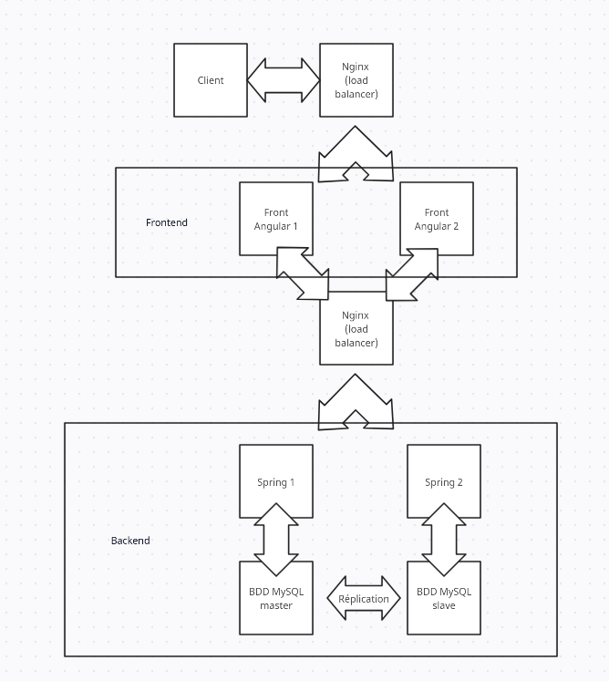

# Projet FUTFUTFUT

Bienvenue sur le projet **FUTFUTFUT**, un mini-site permettant de créer et d’afficher des cartes style FUT (FIFA Ultimate Team).  
Le but est de pouvoir **ajouter des joueurs** (nom, stats, etc.) et de les voir apparaître sur le site.

## Equipe

MOUNIC Clément
CARRERE-GEE Olivier

## Architecture

Voici un aperçu de l’architecture globale (front, back, BDD, NGINX).  

### Composants principaux

1. **Nginx**  
   - Sert de **load balancer** et de reverse proxy.  
   - Répartit les requêtes entre deux instances **Angular** (front) et deux instances **Spring Boot** (back).  
   - Si l’une des instances tombe, spring ou angular, (par ex. `docker stop angular_app1`), Nginx redirige automatiquement le trafic vers l’autre instance disponible après un certain temps.

2. **Angular (x2)**  
   - Front-end de l’application (interface utilisateur).  
   - Permet de créer et voir les cartes FUT.  

3. **Spring Boot (x2)**  
   - Back-end qui gère la logique métier et l’accès aux données.  
   - Une instance pointe sur la base **MySQL Master**, l’autre sur **MySQL Slave**.  

4. **MySQL Master/Slave**  
   - Bases de données en **réplication Master/Slave**.  

5. **ELK (Elasticsearch, Logstash, Kibana)**  
   - Centralise les **logs** Nginx.  
   - Permet de les visualiser (Kibana) et de les interroger (Elasticsearch).

## Démarrage du projet

1. **Cloner** ce dépôt.
2. Dans le répertoire du projet, lancer la stack :
   docker-compose up --build
   **ATTENTION** Il faut attendre quelques minutes que le projet se lance car la bdd est conséquente.

Cela va construire les images (Angular, Spring Boot) et démarrer tous les conteneurs (Nginx, MySQL Master/Slave, ELK, etc.).

Une fois le déploiement terminé, ouvrez votre navigateur sur :
   - http://localhost:8080 : Proxy Nginx (redirige automatiquement vers Angular).
   - http://localhost:5601 : Interface Kibana (voir et analyser les logs).
   - http://localhost:9200 : Elasticsearch (API REST, pas d’interface graphique).

## Exemple d’analyse

Rendez-vous sur http://localhost:5601
Créez un “index pattern” pour nginx-logs-*.
Allez dans l’onglet Discover pour voir les logs.

## Pour arrêter la stack, faire :
docker-compose down -v
